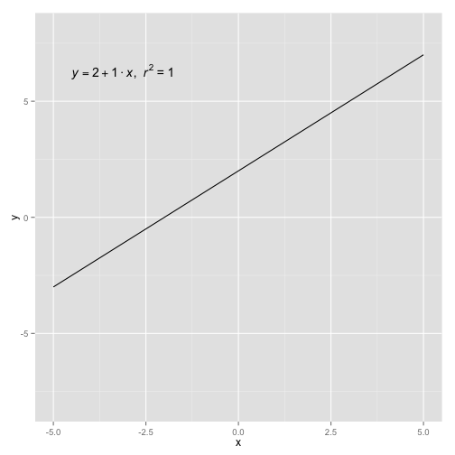
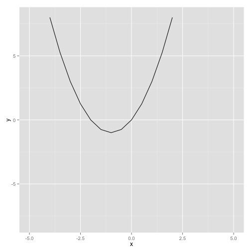

Interactive Learning of Linear and Parabola Functions 
========================================================
author: Elisa Garcia Corisco

Goal
========================================================

The shiny app created in the previous execsice has been developed in order that kids can learn easily how the linear and the parabola function behave.

- The user can change the parameters of the function
- The functions are visualized
  + the previous function (red)
  + the new function (blue)

Linear
========================================================

The function ```lineal_function``` is called to generate the data to plot the function.


```r
lineal_function <- function(a, b)
    {
      x <- seq(-5, 5, 0.5)
      y <- a*x + b
      y
    }

m <- 1
n <- 2
y <- lineal_function(m, n)
```

Linear - plot
========================================================
 

Parabola
========================================================

The function ```parabola``` is called to generate the data to plot the function.


```r
parabola <- function(a, b, c)
{
  x <- seq(-5, 5, 0.5)
  y <- a*x^2 + b*x + c
  y
} 

a <- 1
b <- 2
c <- 0
y <- parabola(a, b, c)
```

Parabola - plot
========================================================

 

Thank you
========================================================
Any question? =)
